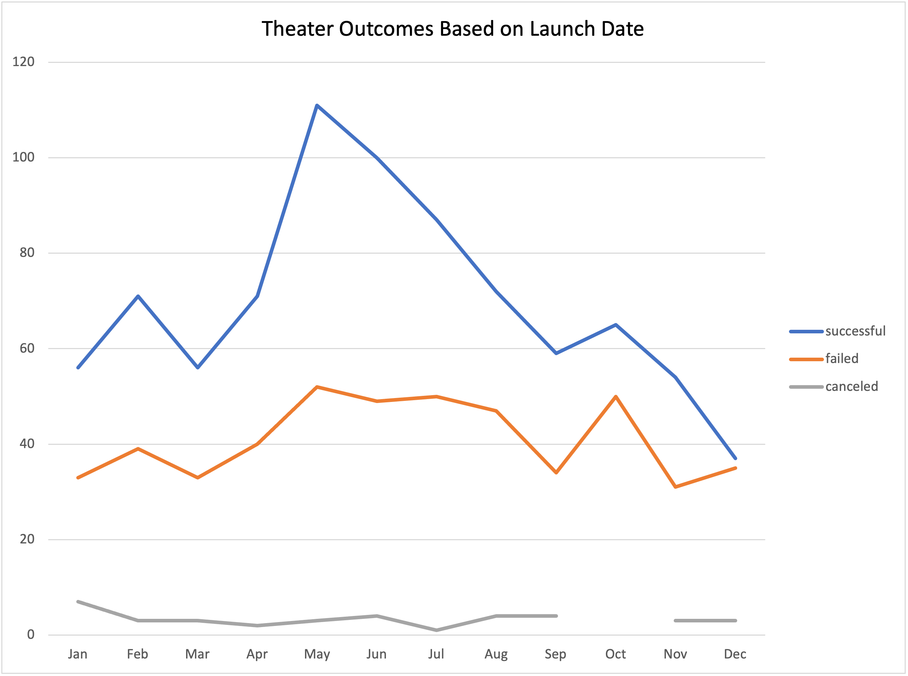
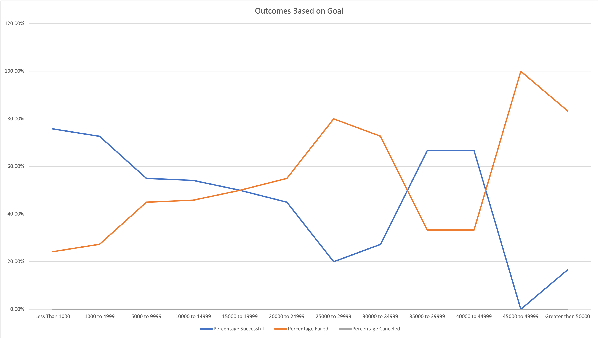

# Kickstarting with Excel

## Overview of Project

### Purpose
  The analysis was performed to help the client understand the best time to launch a fundraising campain and also to understand what might be a goal that will be the most successful.
## Analysis and Challenges

### Analysis of Outcomes Based on Launch Date

### Analysis of Outcomes Based on Goals

### Challenges and Difficulties Encountered
  - A challenge that might have been encountered is a possibilty that there isn't enough data to use in drawing a conclusion. Outliers would also make it hard to find trends in the data.
## Results

- What are two conclusions you can draw about the Outcomes based on Launch Date?
  1. The month of May would be the best time to launch a campain.
  2. December is a month that would not be recommended. Campains started in December tend to fail.
- What can you conclude about the Outcomes based on Goals?
  - Campains that have goals of less than $1,000 tend to be successful. However, $1,000 may not be enough funding for the event. Therefore, goals of $35,000 to $45,000 might be considered.
- What are some limitations of this dataset?
  - The dataset would be more useful if there were more datapoints. After filtering down the data there is a to small amount of it. The data could be more current.
- What are some other possible tables and/or graphs that we could create?
  - A graph that indicates the average donation that needs to be acheived for a given goal.
