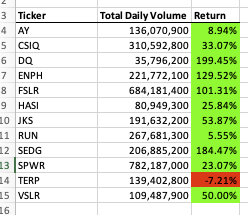
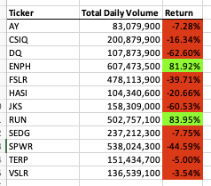

# Overview of Project:
The purpose of the project is to develope a spreadsheet that shows information about a group of 12 stocks. The results show the total dialy volume and the return for the stocks for the years 2017 and 2018.
# Results:

As the images below show, 2017 was a mutch better year for stock returns. The DQ stock probably should be sold and reinvested in either ENPH or RUN to get a better return.

## Performance for 2017

## Performance for 2018

## Timing Results for My Code

## Timing Results for 2017 refactored code

## Timing Results for 2018 refactored code

# Summary:
  1. The advantages of refactoring code are that hopefully when you take a second look at the code you can come up with a clearer way to implement the solution.
  2. My original VBA script was not developed with speed of execution in mind. The goal of my code was to create something that was configurable in the case that the data was different. I created constants that can be changed if needed so that the values don't have to be changed throughout the code. I also put some of the logic in subroutines to make the higher level code more readable. This caused a performance hit.
